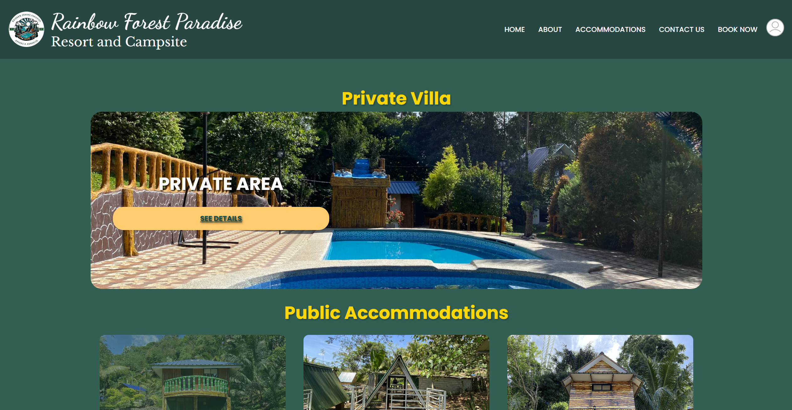
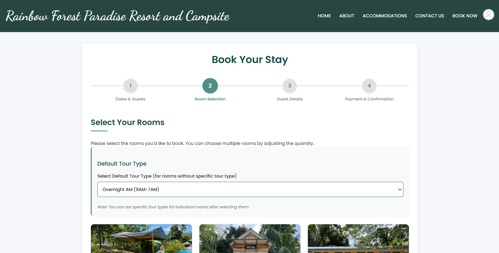
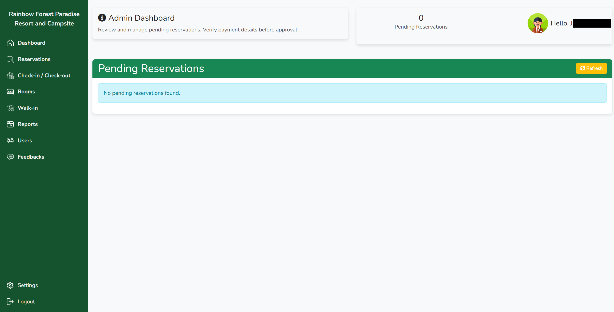
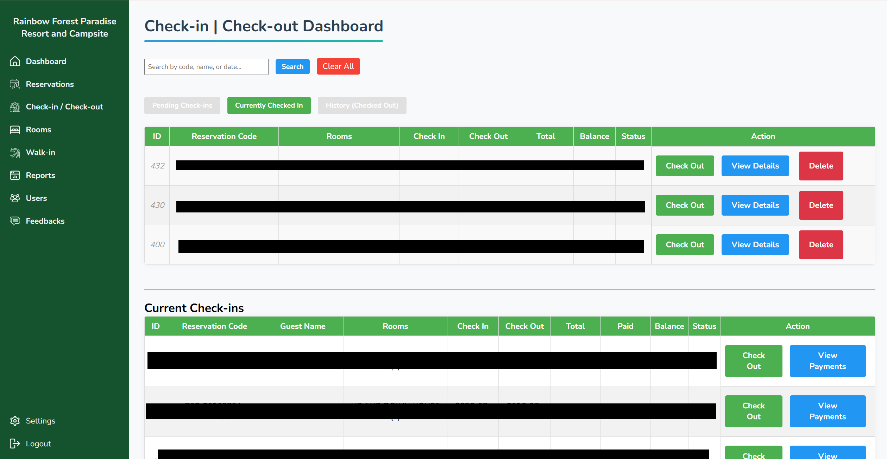

# Resort Reservation and Billing System

A full-stack web application built for Rainbow Forest Paradise Resort and Campsite, handling room reservations, guest billing, and admin management. Originally developed as a capstone project and deployed for real-world use.

## Overview

This system allows guests to browse available rooms, submit reservations, and upload proof of payment, while giving admin staff tools to manage bookings, verify payments, and track billing — all through a custom-built PHP backend.

## Tech Stack

- **Backend:** PHP
- **Database:** MySQL
- **Frontend:** HTML, CSS, JavaScript
- **PDF Generation:** TCPDF
- **Server:** Apache (XAMPP for local development)

## Features

### Guest-facing
- Browse available rooms with details and pricing
- Submit reservation requests
- Upload proof of payment and transaction number
- Receive booking confirmation
- Submit feedbacks
- Create a verified account (email verification) to track reservation history
- Self-service rescheduling with built-in business rules (must be within 6 months of original booking, one reschedule allowed per reservation, automatic availability check before confirming)

### Admin-facing
- Secure admin login
- View, approve, and manage reservations
- Verify uploaded payment proofs
- Generate and track billing
- Add, edit, and manage room listings — including toggling availability (e.g. marking a room under maintenance) — without needing developer involvement
- Record walk-in guests (no prior online reservation) with visit details, room type, party size, and payment method, plus a live summary of total walk-in bookings, rooms occupied, and revenue
- Generate reservation, check-ins, check-outs, and sales reports
- Verify each feedbacks for approval

### Front Desk Operations
- **Check-in / Check-out Dashboard** — track guests through pending check-ins, currently checked-in status, and checkout history, searchable by reservation code, name, or date
- **Checkout billing** — log damage reports or additional charges at checkout, with the system automatically recalculating the final balance due before payment is processed

## Screenshots

### Guest Experience

| Homepage | Room Browsing | Reservation Form |
|---|---|---|
|  |  |  |

### Admin Dashboard

| Admin Dashboard / Reservation Management | Check-in and Check-out Dashboard |
|---|---|
|  |  |

## Getting Started

### Prerequisites
- [XAMPP](https://www.apachefriends.org/) (or any PHP + MySQL environment)
- PHP 8.x
- MySQL / MariaDB

### Setup

1. Clone this repository into your `htdocs` folder (or equivalent):
   ```
   git clone https://github.com/jezellef/resort-reservation-billing-system.git
   ```

2. Import the database schema:
   - Open phpMyAdmin
   - Create a new database
   - Import `u291458526_resort_db_.sql` (includes table structure and sample/fake demo data)

3. Set up your local config:
   - Copy `config.example.php` and rename it to `config.php`
   - Update it with your local database credentials

4. Start Apache and MySQL via XAMPP, then visit:
   ```
   http://localhost/resort-reservation-billing-system/
   ```

## Notes

- Real admin credentials and production data (guest info, payment receipts, uploaded images) are excluded from this repository for privacy and security. The database file included here contains only sample/demo data.
- This project was originally deployed and used in production for a real resort for approximately one year.

## Author

Jezelle Formentera
[Portfolio](https://jezellef.github.io) · [GitHub](https://github.com/jezellef)